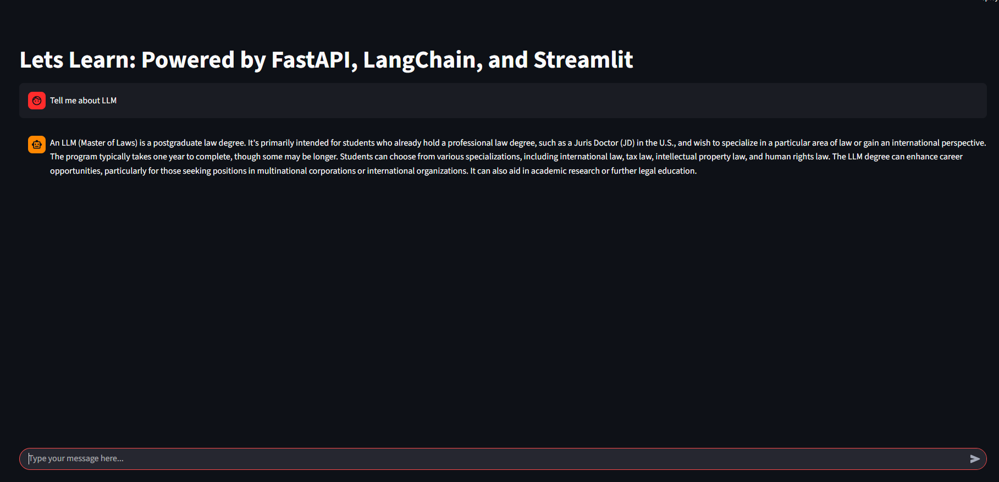

# 💬 Let's Learn

**Let’s Learn** is a modular **AI chat application** built using **FastAPI** for backend APIs and **Streamlit** for the frontend interface.
It integrates **Hugging Face models** (via the Inference API) or **Ollama** for local inference and supports **asynchronous streaming** for smooth, real-time chat responses.

---

## 🖼️ Preview


<p align="center">
  
</p>

---

## ⚙️ Tech Stack

| Layer              | Technology                |
| :----------------- | :------------------------ |
| **Frontend**       | Streamlit                 |
| **Backend**        | FastAPI + Uvicorn         |
| **LLM Providers**  | Hugging Face Hub / Ollama |
| **Async Engine**   | Python `asyncio` + SSE    |  |

---

## 🚀 Quickstart

### 1️⃣ Setup environment

```bash
python -m venv .venv
source .venv/bin/activate      # On Windows: .venv\Scripts\activate
```

### 2️⃣ Install dependencies

```bash
pip install -r requirements.txt
```

### 3️⃣ Configure environment

Open `.env` and **add your Hugging Face API token**:

```bash
HFHUB_API_TOKEN=hf_your_token_here
```

👉 If you don’t have one yet:

1. Go to [https://huggingface.co/settings/tokens](https://huggingface.co/settings/tokens)
2. Click **“New Token”** → choose type **Read**
3. Copy it and paste into your `.env` file as shown above.

---

### 4️⃣ Start backend (FastAPI)

```bash
uvicorn app.main:app --reload --port 8000
```

### 5️⃣ Start frontend (Streamlit)

In a new terminal:

```bash
streamlit run frontend/app.py --server.port 8501
```

✅ Open the Streamlit app at [http://localhost:8501](http://localhost:8501)

---

## 🧩 Features

* ⚡ **FastAPI backend** for scalable, async inference
* 💬 **Streamlit chat interface** with real-time updates
* 🔌 **Multiple model providers** (Hugging Face, Ollama)
* 🧠 **Session memory** for chat continuity
* 🧰 Modular design for easy extensions (tools, agents, RAG, etc.)

---

## ⚙️ Environment Variables (`.env`)

```bash
# Default: Hugging Face setup
PROVIDER=hfhub
HFHUB_REPO_ID=mistralai/Mistral-7B-Instruct-v0.2
HFHUB_API_TOKEN=hf_your_token_here
SSE_CHUNK_DELAY_MS=0

# Optional: Ollama setup
PROVIDER=ollama
OLLAMA_MODEL=mistral
OLLAMA_BASE_URL=http://localhost:11434
```

